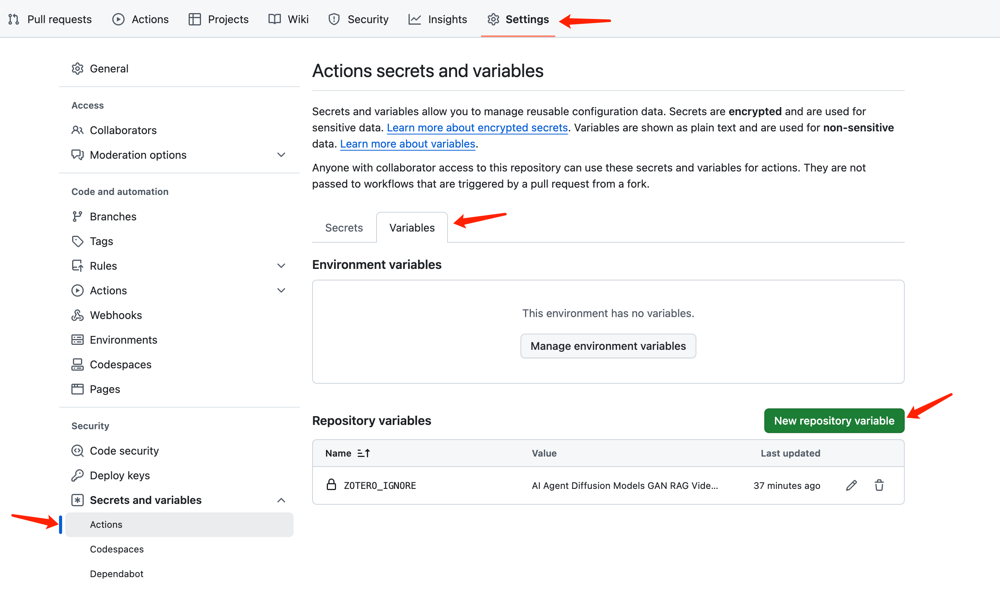
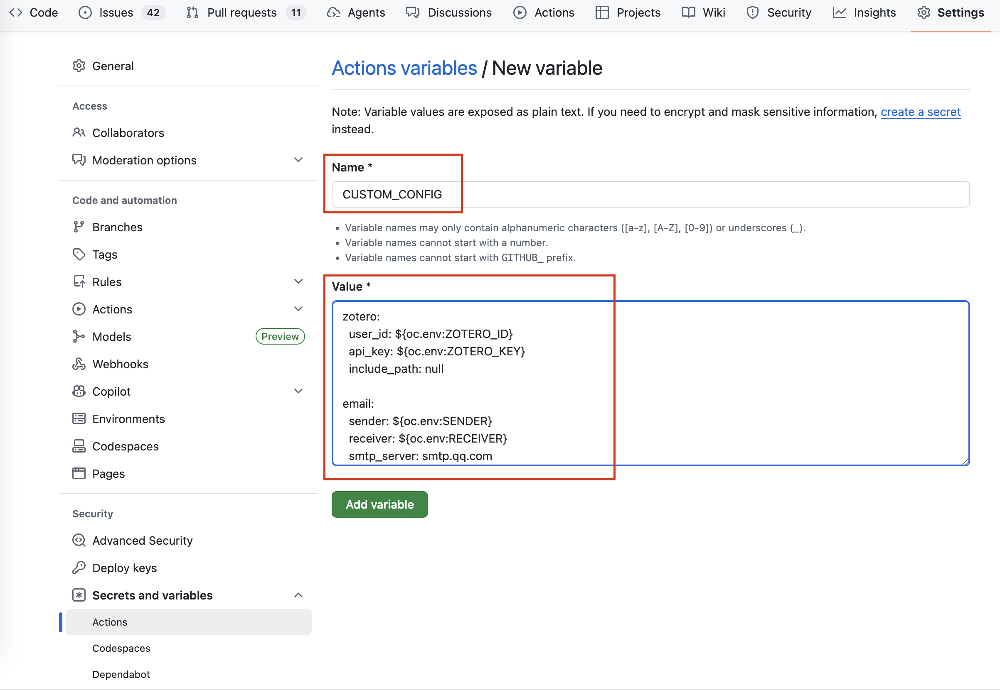
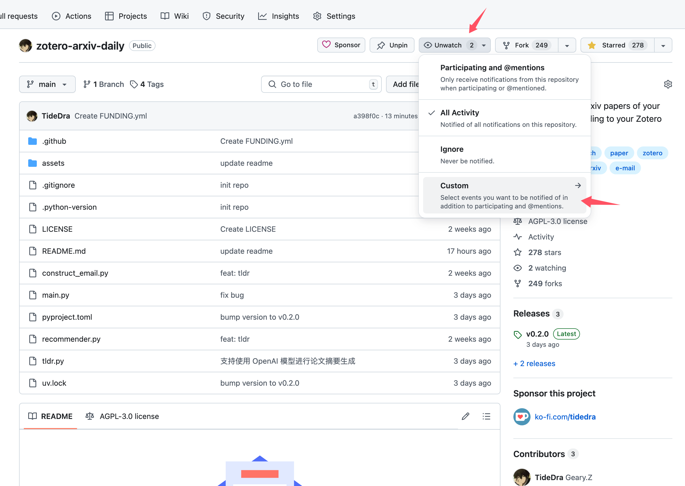

<p align="center">
  <a href="" rel="noopener">
 </a>
</p>

<h3 align="center">Zotero-arXiv-Daily</h3>

<div align="center">

  []()
  
  [](https://github.com/TideDra/zotero-arxiv-daily/issues)
  [](https://github.com/TideDra/zotero-arxiv-daily/pulls)
  [](/LICENSE)
  [](https://api.gitsponsors.com/api/badge/link?p=PKMtRut1dWWuC1oFdJweyDSvJg454/GkdIx4IinvBblaX2AY4rQ7FYKAK1ZjApoiNhYEeduIEhfeZVIwoIVlvcwdJXVFD2nV2EE5j6lYXaT/RHrcsQbFl3aKe1F3hliP26OMayXOoZVDidl05wj+yg==)

</div>

---

<p align="center"> Recommend new arxiv papers of your interest daily according to your Zotero library.
    <br> 
</p>

> [!IMPORTANT]
> Please keep an eye on this repo, and merge your forked repo in time when there is any update of this upstream, in order to enjoy new features and fix found bugs.

## 🧐 About <a name = "about"></a>

> Track new scientific researches of your interest by just forking (and staring) this repo!😊

*Zotero-arXiv-Daily* finds arxiv papers that may attract you based on the context of your Zotero library, and then sends the result to your mailbox📮. It can be deployed as Github Action Workflow with **zero cost**, **no installation**, and **few configuration** of Github Action environment variables for daily **automatic** delivery.

## ✨ Features
- Totally free! All the calculation can be done in the Github Action runner locally within its quota (for public repo).
- AI-generated TL;DR for you to quickly pick up target papers.
- Affiliations of the paper are resolved and presented.
- Links of PDF and code implementation (if any) presented in the e-mail.
- List of papers sorted by relevance with your recent research interest.
- Fast deployment via fork this repo and set environment variables in the Github Action Page.
- Support LLM API for generating TL;DR of papers.
- Ignore unwanted Zotero papers using a list of glob patterns.
- Support multiple sources of papers to retrieve:
  - arxiv
  - biorxiv
  - medrxiv

## 📷 Screenshot


## 🚀 Usage
### Quick Start
1. Fork (and star😘) this repo.


2. Set Github Action environment variables.


Below are all the secrets you need to set. They are invisible to anyone including you once they are set, for security.

| Key |Description | Example |
| :---  | :---  | :--- |
| ZOTERO_ID  | User ID of your Zotero account. **User ID is not your username, but a sequence of numbers**Get your ID from [here](https://www.zotero.org/settings/security). You can find it at the position shown in this [screenshot](https://github.com/TideDra/zotero-arxiv-daily/blob/main/assets/userid.png). | 12345678  |
| ZOTERO_KEY | An Zotero API key with read access. Get a key from [here](https://www.zotero.org/settings/security).  | AB5tZ877P2j7Sm2Mragq041H   |
| SENDER | The email account of the SMTP server that sends you email. | abc@qq.com |
| SENDER_PASSWORD | The password of the sender account. Note that it's not necessarily the password for logging in the e-mail client, but the authentication code for SMTP service. Ask your email provider for this.   | abcdefghijklmn |
| RECEIVER | The e-mail address that receives the paper list. | abc@outlook.com |
| OPENAI_API_KEY | API Key when using the API to access LLMs. You can get FREE API for using advanced open source LLMs in [SiliconFlow](https://cloud.siliconflow.cn/i/b3XhBRAm). | sk-xxx |
| OPENAI_API_BASE | API URL when using the API to access LLMs. | https://api.siliconflow.cn/v1 |

Then you should also set a public variable `CUSTOM_CONFIG` for your custom configuration.


Paste the following content into the value of `CUSTOM_CONFIG` variable:
```yaml
zotero:
  user_id: ${oc.env:ZOTERO_ID}
  api_key: ${oc.env:ZOTERO_KEY}
  include_path: null # Or e.g. ["2026/survey/**", "2026/reading-group/**"]

email:
  sender: ${oc.env:SENDER}
  receiver: ${oc.env:RECEIVER}
  smtp_server: smtp.qq.com
  smtp_port: 465
  sender_password: ${oc.env:SENDER_PASSWORD}

llm:
  api:
    key: ${oc.env:OPENAI_API_KEY}
    base_url: ${oc.env:OPENAI_API_BASE}
    user_agent: null
  generation_kwargs:
    model: gpt-4o-mini

source:
  arxiv:
    category: ["cs.AI","cs.CV","cs.LG","cs.CL"]
    include_cross_list: false # Set to true to include arXiv cross-list papers in these categories.

executor:
  debug: ${oc.env:DEBUG,null}
  source: ['arxiv']
```
Set `source.arxiv.include_cross_list: true` if you want cross-listed papers included.

By default, `llm.api.user_agent` is `null`, so the OpenAI Python SDK sends its own User-Agent. If a third-party OpenAI-compatible API provider or gateway rejects requests based on that header (which may cause `Failed to generate tl;dr`), set an explicit value such as `zotero-arxiv-daily/1.0`.

>[!NOTE]
> `${oc.env:XXX,yyy}` means the value of the environment variable `XXX`. If the variable is not set, the default value `yyy` will be used.

Here is the full configuration, `???` means the value must be filled in:
```yaml
zotero:
  user_id: ??? # User ID of your Zotero account.
  api_key: ??? # An Zotero API key with read access.
  include_path: null # A list of glob patterns marking the Zotero collections that should be included. Example: ["2026/survey/**", "2026/reading-group/**"]
  ignore_path: null # A list of glob patterns marking the Zotero collections that should be excluded. Example: ["archive/**"]

source:
  arxiv:
    category: null # The categories of target arxiv papers. Find the abbr of your research area from [here](https://arxiv.org/category_taxonomy). Example: ["cs.AI","cs.CV","cs.LG","cs.CL"]
    include_cross_list: false # Whether to include arXiv cross-list papers in subscribed categories. Example: true
  biorxiv:
    category: null # The categories of target biorxiv papers. Find categories from [here](https://www.biorxiv.org/). Example: ["biochemistry","animal behavior and cognition"]
  medrxiv:
    category: null # The categories of target medrxiv papers. Find categories from [here](https://www.medrxiv.org/) Example: ["psychiatry and clinical psychology", "neurology"]

email:
  sender: ??? # The email account of the SMTP server that sends you email. Example: abc@qq.com
  receiver: ??? # The email account that receives the paper list. Example: abc@outlook.com
  smtp_server: ??? # The SMTP server that sends the email. Ask your email provider (Gmail, QQ, Outlook, ...) for its SMTP server. Example: smtp.qq.com
  smtp_port: ??? # The port of SMTP server. Example: 465
  sender_password: ??? # The password of the sender account. Note that it's not necessarily the password for logging in the e-mail client, but the authentication code for SMTP service. Ask your email provider for this. Example: abcdefghijklmn

llm:
  api:
    key: ??? # API Key of your LLM API. Example: sk-xxx
    base_url: ??? # API URL of your LLM API. Example: https://api.openai.com/v1
    user_agent: null # Optional HTTP User-Agent override. Example: zotero-arxiv-daily/1.0
  generation_kwargs:
  # Arguments for the LLM API. See [here](https://platform.openai.com/docs/api-reference/chat/create) for more details.
    max_tokens: 16384
    model: ???
  language: English # Preferred language for the TL;DR. Example: English

reranker:
  local:
    model: jinaai/jina-embeddings-v5-text-nano-retrieval # The Hugging Face model name of the local embedding model.
    encode_kwargs:
    # The kwargs for the encode method of the local embedding model. Details see [here](https://www.sbert.net/docs/package_reference/SentenceTransformer.html#sentence_transformers.SentenceTransformer.encode)
      task: retrieval
      prompt_name: document
  api:
    key: null # API Key of your embedding model API. Example: sk-xxx
    base_url: null # API URL of your embedding model API. Example: https://api.openai.com/v1
    model: null # The model name of the embedding model. Example: text-embedding-3-large
    batch_size: null # The batch size for embedding API requests. Adjust to match your provider's limit. Example: 64

executor:
  debug: false # Whether to use debug mode. Example: true
  send_empty: false # Whether to send an empty email even if no new papers today. Example: true
  max_paper_num: 100 # The maximum number of the papers presented in the email. Example: 100
  source: ??? # The sources of papers to retrieve. Example: ['arxiv','biorxiv','medrxiv']
  reranker: local # The reranker to use. Example: 'local' or 'api'
```

That's all! Now you can test the workflow by manually triggering it:


> [!NOTE]
> The Test workflow enables debug mode and retrieves at most 10 papers from each configured source. It still uses the real Zotero, LLM, and SMTP services and sends a real e-mail. The daily workflow reads the latest source feed; when no papers are announced, it logs "No new papers found" and does not send an e-mail unless `executor.send_empty` is enabled.

Then check the log and the receiver email after it finishes.

By default, the main workflow runs at 22:00 UTC every day. You can change this time by editing `.github/workflows/main.yml`.

### Local Running
Install [uv](https://github.com/astral-sh/uv), then create a `.env` file in the repository root. The file is ignored by Git and is loaded automatically:

```dotenv
ZOTERO_ID=12345678
ZOTERO_KEY=your-zotero-key
SENDER=sender@example.com
RECEIVER=receiver@example.com
SENDER_PASSWORD=your-smtp-password
OPENAI_API_KEY=sk-xxx
OPENAI_API_BASE=https://api.openai.com/v1
```

Keep non-secret settings in `config/custom.yaml`, then run:

```bash
cd zotero-arxiv-daily
uv run src/zotero_arxiv_daily/main.py
# `uv run` creates or updates the project virtual environment automatically. 
```

For a quicker end-to-end check, enable debug mode, restrict the source categories, and generate an e-mail for only the highest-ranked paper:

```bash
uv run src/zotero_arxiv_daily/main.py \
  executor.debug=true \
  executor.max_paper_num=1 \
  'source.arxiv.category=[cs.GR]'
```

Debug mode limits retrieval to at most 10 papers per source. `executor.max_paper_num` is applied after retrieval and reranking, so it limits LLM calls and e-mail entries but does not reduce the number of papers downloaded and ranked.

### Testing

Most tests use local stubs and do not call Zotero, LLM, or SMTP services:

```bash
# Exclude the slow local embedding-model test (default)
uv run pytest

# Include all tests, including model download and inference
uv run pytest -m ""

# Run with coverage
uv run pytest --cov=src/zotero_arxiv_daily --cov-report=term-missing
```

## 🚀 Sync with the latest version
This project is in active development. You can subscribe this repo via `Watch` so that you can be notified once we publish new release.




## 📖 How it works
*Zotero-arXiv-Daily* retrieves papers with abstracts from your Zotero library and uses the configured collection filters to build an interest corpus. It reads current announcements from the arXiv RSS feed or the latest dated results from the bioRxiv/medRxiv API, then calculates abstract embeddings and ranks candidates by their weighted similarity to the Zotero corpus. More recently added Zotero papers receive greater weight.

For arXiv papers, full text is extracted from the TeX source when possible, with arXiv HTML and PDF-to-Markdown extraction as fallbacks. The highest-ranked papers are sent to the configured LLM for TL;DR and affiliation generation before an HTML e-mail is delivered through SMTP. The bioRxiv and medRxiv retrievers currently do not extract full text, so their TL;DRs use abstracts and affiliation extraction is skipped.

## 📌 Limitations
- The recommendation algorithm is very simple, it may not accurately reflect your interest. Welcome better ideas for improving the algorithm!
- A high `executor.max_paper_num` increases LLM usage and may cause a run to exceed GitHub Actions time or usage limits (6h per execution for public repo, and 2000 mins per month for private repo). It does not limit the number of candidates downloaded and reranked. For heavier workloads, consider running locally or using a self-hosted runner.


## 📃 License
Distributed under the AGPLv3 License. See `LICENSE` for detail.

## ❤️ Acknowledgement
- [pyzotero](https://github.com/urschrei/pyzotero)
- [arxiv](https://github.com/lukasschwab/arxiv.py)
- [sentence_transformers](https://github.com/UKPLab/sentence-transformers)

## ☕ Buy Me A Coffee
If you find this project helpful, welcome to sponsor me via WeChat or via [ko-fi](https://ko-fi.com/tidedra).


## 🌟 Star History

[](https://star-history.com/#TideDra/zotero-arxiv-daily&Date)
